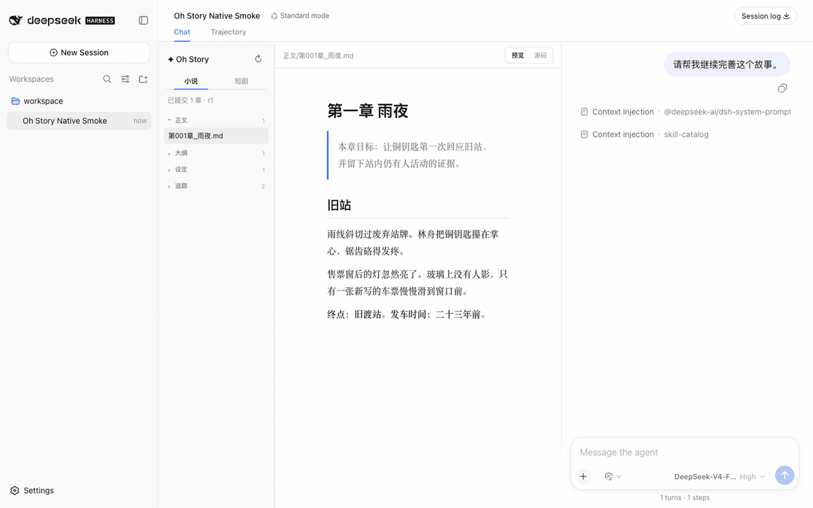
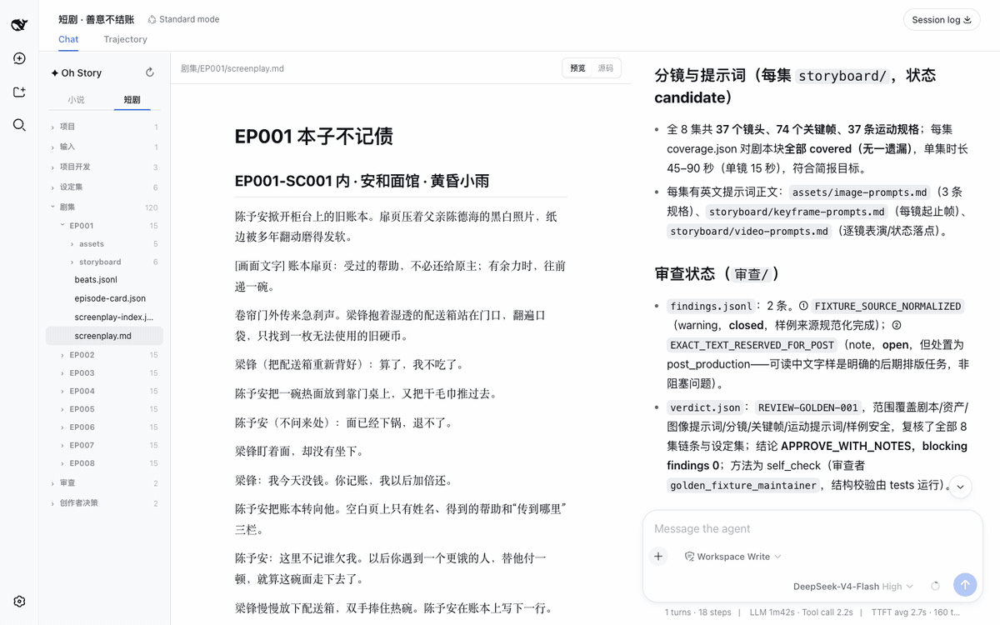

<div align="center">

# Oh Story DSH

**DeepSeek Harness 原生小说与短剧创作工作台**

[DeepSeek Harness](https://github.com/deepseek-ai/deepseek-harness) · [Oh Story](https://github.com/worldwonderer/oh-story-claudecode) · [Drama Skills](https://github.com/worldwonderer/drama-skills) · [MIT](LICENSE)

</div>

Oh Story DSH 把成熟的小说方法库和短剧生产流程带入 DeepSeek Harness。Agent、会话、模型、权限与 Chat 由 DSH 统一管理；插件提供创作 Skills、专业 Roles、项目协议和与官方界面融为一体的三栏工作台。

## 小说工作台



覆盖长篇、短篇、选题、扫榜、拆文、导入、审稿、去 AI 味与封面流程。13 个 Oh Story Skills 与 7 个专业 Roles 按固定上游版本随插件交付。

## 短剧工作台



覆盖原著分析、项目开发、剧本、资产、分镜、图像提示词、视频提示词、审查与生产交付。短剧 Tab 识别 `short-drama.json` 与标准项目目录，按集组织创作文件。

## 核心体验

- **原生三栏布局**：项目文件树、编辑器与官方 Chat 同屏，Trajectory、工具执行、Todo、审批和 Composer 保持 DSH 原生交互。
- **实时文件跟随**：Agent 调用官方 `write`、`edit` 或 `str_replace_editor` 时，目标文件自动定位，编辑器同步呈现生成中的内容。
- **Chat 文件导航**：点击官方 Chat 中的作品文件名，文件树会定位并在编辑器打开对应文件。
- **Markdown 双视图**：作品文档支持排版预览与源码编辑；`⌘/Ctrl + S` 保存，只有存在未保存修改时才出现保存操作。
- **稳定长对话**：消息区独立滚动，官方 Composer 固定在 Chat 栏底部。
- **创作者优先**：人工未保存内容受到保护；并发 Agent 修改会显示冲突状态，由创作者决定如何处理。

## 能力目录

| 工作台 | 上游能力 | 主要入口 |
| --- | --- | --- |
| 小说 | Oh Story 0.7.6 · 13 Skills · 7 Roles | `/story`、`/story-long-write`、`/story-review` |
| 短剧 | Drama Skills · 10 Skills | `/short-drama`、`/short-drama-write`、`/short-drama-storyboard` |

短剧流程包含 `short-drama-assets`、`short-drama-develop`、`short-drama-image-prompts`、`short-drama-novel-analyze`、`short-drama-produce`、`short-drama-review`、`short-drama-storyboard`、`short-drama-video-prompts` 与 `short-drama-write`。生产步骤延续上游的显式确认协议，并使用 DSH 的权限与审批界面。

## 安装

要求 Node.js 24+、pnpm 11.7+ 与 DeepSeek Harness `0.1.0-rc.8`。

```bash
pnpm install --frozen-lockfile
pnpm build
mkdir -p dist
pnpm --filter @oh-story/dsh pack --pack-destination dist

dsh plugin --profile web add "$PWD/dist/oh-story-dsh-0.1.0-alpha.0.tgz"
dsh web
```

在 DSH 中将作品目录添加为 workspace，新建或打开 Session 即可。存在小说目录时默认进入小说工作台；只有 `short-drama.json` 的项目默认进入短剧工作台，也可以随时通过左栏 Tab 切换。

编辑器单文件大小上限可在 DSH 插件配置中调整：

```yaml
- id: oh-story
  config:
    editorMaxBytes: 2097152
```

## 开发与验证

```bash
pnpm verify          # lint、类型、资产校验、边界检查、单测与构建
pnpm test:dsh        # 打包安装到临时官方 DSH Web，验证 Session、Skills 与 UI
pnpm test:dsh:real   # 可选：使用真实 DeepSeek provider 验证完整 Agent 路径
```

仓库只有一个产品包 [`packages/dsh-plugin`](packages/dsh-plugin)。上游能力分别固定在 [`packages/knowledge/vendor`](packages/knowledge/vendor) 与 [`packages/knowledge/drama`](packages/knowledge/drama)，提交、文件哈希与许可证可在各自 manifest 和 [`THIRD_PARTY_NOTICES.md`](THIRD_PARTY_NOTICES.md) 中核验。

实现细节见 [`docs/ARCHITECTURE.md`](docs/ARCHITECTURE.md)，验证范围见 [`docs/VALIDATION.md`](docs/VALIDATION.md)。
